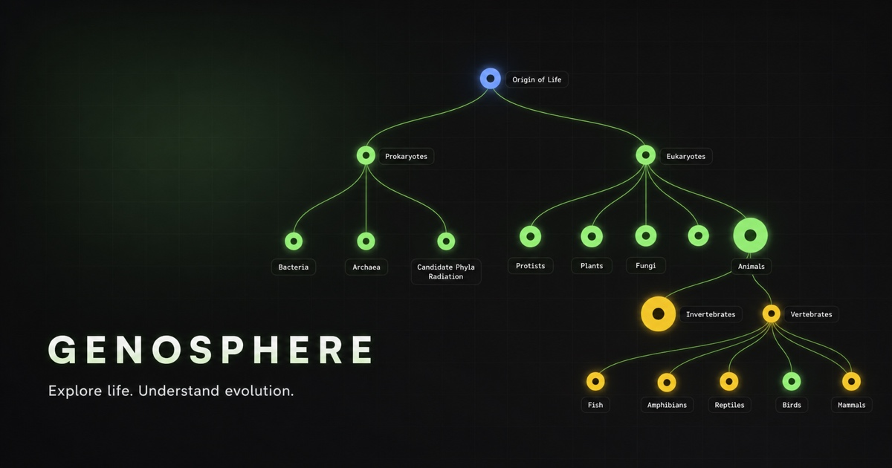

# Genosphere

Genosphere is an open-source interactive Tree of Life explorer and adaptive evolution tutor with a Groq-powered AI guide. Teachers, researchers, naturalists, and curious people can browse evolutionary relationships, inspect biological summaries, search the tree, and ask follow-up questions about a selected node.

[Explore the live site](https://genosphere.vercel.app) · [Report a scientific correction](https://github.com/yakshb/tree-of-life/issues/new/choose) · [Contribute](CONTRIBUTING.md)




## Features

- Zoomable, pannable phylogenetic tree with expandable branches
- Search and exploration-path navigation
- Standardized biological summaries and geological context for 124 curated nodes
- Live taxonomic reconciliation, descendant coverage, common names, and licensed media
- Streaming AI chat grounded in the selected node
- AI-generated suggested questions with local fallbacks
- Runtime model availability checks through GroqCloud
- Light and dark themes

## Project status

Genosphere is an early public project seeking scientific reviewers, educators,
and graph-interface contributors. The current
124-node topology is a curated teaching map—not a complete or publication-ready
phylogeny. Live GBIF and iNaturalist enrichment can change as those providers
update; important claims should be checked against the displayed provenance and
primary sources.

See [scientific integrity and data provenance](docs/scientific-integrity.md) for
the project's trust boundaries.

## Use cases

- **Adaptive evolution tutor — available now:** node-grounded explanations, branch comparisons, and guided questions for teaching and independent learning.
- **Biodiversity field guide — near-term extension:** taxonomy, licensed media, common names, observations, and location overlays. Taxonomic enrichment and media work today; spatial observation layers are planned.
- **Taxonomic curation workbench — medium-term direction:** detect synonyms, rank conflicts, missing data, and topology drift with source-aware review workflows.
- **Paleobiology timeline — medium-term direction:** explore taxa through geological time, evolutionary radiations, and extinction events.

The deployed site includes a crawlable page for each direction while clearly separating current capabilities from roadmap work.

## Help shape the project

You do not need to be both a biologist and a software engineer. The most useful
help right now is deliberately narrow:

- **Review one branch:** identify a misleading relationship, summary, time range,
  taxonomic match, or image and provide a source.
- **Try one real lesson:** explain where a student or teacher becomes confused.
- **Improve the experience:** help with shareability, keyboard access, responsive
  behavior, search, testing, or graph navigation.

Start with the [structured issue forms](https://github.com/yakshb/tree-of-life/issues/new/choose)
or read [CONTRIBUTING.md](CONTRIBUTING.md) before a larger change. Participation
is governed by the [Code of Conduct](CODE_OF_CONDUCT.md).

## Groq models

The chat model can be changed from the AI Settings panel. The server accepts only these model IDs:

- `llama-3.1-8b-instant` (default and prompt generation)
- `llama-3.3-70b-versatile`
- `openai/gpt-oss-120b`
- `openai/gpt-oss-20b`

`GET /api/models` calls Groq's OpenAI-compatible `GET /openai/v1/models` endpoint, returns Groq's active catalog as `availableModels`, and reports whether each configured app model is currently active in `models`. Model IDs sent by clients are validated against the server-side allowlist before inference.

## Stack

- Next.js 16 App Router and React 19
- TypeScript
- Tailwind CSS and Radix UI
- react-d3-tree
- GroqCloud's OpenAI-compatible REST API

The app uses native `fetch` and web streams, so no OpenAI or legacy AI SDK dependency is required.

## Local setup

Requirements:

- Node.js `^20.19`, `^22.13`, or `>=24`
- A [GroqCloud API key](https://console.groq.com/keys)

```bash
git clone https://github.com/yakshb/tree-of-life.git
cd tree-of-life
npm install
cp .env.example .env.local
```

Set your Groq key in `.env.local`:

```bash
GROQ_API_KEY=your_groq_api_key
```

Start the development server:

```bash
npm run dev
```

Open [http://localhost:3000](http://localhost:3000).

## Quality checks

```bash
npm run lint
npm run typecheck
npm run build
```

Run all three with `npm run check`. Production builds use Webpack for broad
environment compatibility; `npm run build:turbopack` opts into Next.js 16's
default Turbopack builder.

## API routes

- `POST /api/chat` validates the selected model, request size, message count, message length, temperature, and node context, then proxies a streaming Groq chat completion.
- `POST /api/generate-prompts` generates four suggested biology questions with the fast Llama 3.1 8B model.
- `GET /api/models` checks the four configured IDs against Groq's active model catalog.
- `GET /api/taxa` reconciles curated names against GBIF and independently checks iNaturalist for exact or clearly labeled representative media, lineage, direct descendant taxa, common names, and provenance.

The POST routes include best-effort, per-instance request throttling. Production deployments that need globally consistent abuse protection should add a distributed rate limiter at the platform or data-store layer.

## Project structure

```text
app/                  Next.js pages and API routes
components/           Tree, AI, shared, and UI components
data/treeData.ts      Curated seed topology, normalized at import
lib/taxonomy/         Taxonomy normalization, audits, and source adapters
lib/groq-models.ts    Shared model catalog and allowlist
lib/groq.ts           Server-only Groq API client
types/                Shared application types
```

See [CONTRIBUTING.md](CONTRIBUTING.md) for contribution guidelines,
[SECURITY.md](SECURITY.md) for responsible vulnerability reporting, and
[docs/scientific-integrity.md](docs/scientific-integrity.md) for scientific and
data-source expectations. This project is available under the
[MIT License](LICENSE).
